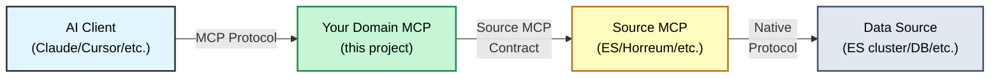

# 📋 Domain MCP Template

[](https://github.com/dustinblack/domain-mcp-template/actions/workflows/ci.yml)
[](https://github.com/dustinblack/domain-mcp-template/actions/workflows/container.yml)
[](LICENSE)

> **🎯 GitHub Template Repository**
>
> Click **"Use this template"** above to create your own Domain MCP server!

---

> **🛑 STOP! READ THIS FIRST.**
>
> You have created a repository from a **Template**.
> Before writing code, you must initialize your project identity and select your data source (Elasticsearch, Horreum, etc.).
>
> **Action:** Follow the steps below, then **DELETE THIS TEMPLATE SETUP GUIDE SECTION** to finalize your README.

## 🔄 Repository Mirrors

This template is available on multiple platforms:

- **GitHub (Primary):** https://github.com/dustinblack/domain-mcp-template
- **GitLab (Mirror):** https://gitlab.com/redhat/edge/tests/perfscale/domain-mcp-template

Both repositories are synchronized automatically. Choose the platform you prefer!

For contributors: You can contribute via either platform - changes are automatically synced.

## 🔌 Understanding Source MCPs

**Important:** Your Domain MCP **requires** a Source MCP to be running or available. The architecture is:



**Your Domain MCP adds domain-specific logic** on top of a generic data source.

### For Elasticsearch Users

**Two options depending on your Elasticsearch version:**

**Option 1: Elastic 9.2.0+ / Serverless (Built-in MCP)**
- **Source MCP:** Built into Elastic Agent Builder
- **No separate installation needed** - part of Elasticsearch
- **Best for:** Latest Elasticsearch deployments

**Option 2: Older Elasticsearch versions (Standalone MCP)**
- **Source MCP:** [elastic/mcp-server-elasticsearch](https://github.com/elastic/mcp-server-elasticsearch) (Docker-based)
- **Installation:** 
  ```bash
  docker run docker.elastic.co/mcp/elasticsearch stdio --help
  ```
- **Best for:** Elasticsearch 8.x and older 9.x versions

**What you'll build:** Domain-specific queries (e.g., "Show payment errors") on top of generic log search

#### 🔌 Choosing stdio vs HTTP Connection Mode

Your Domain MCP can connect to the Elasticsearch MCP in two ways. Choose based on your environment:

| Your Situation | Recommended Mode | Why |
|----------------|------------------|-----|
| 🏢 **Corporate network / VPN** | **HTTP** | Docker networking often problematic with internal DNS |
| 🖥️ **Local dev (ES on localhost)** | **stdio** | Simpler, no extra processes to manage |
| 🐳 **ES already running in Docker** | **HTTP** | Avoid Docker-in-Docker complexity |
| 🚀 **Production deployment** | **HTTP** | Better for monitoring, scaling, and sharing |
| 🧪 **CI/CD testing** | **stdio** | Isolated, no external dependencies |

**Common Issues & Solutions:**

⚠️ **stdio mode + remote ES cluster**: Docker container can't reach `elasticsearch.company.internal`
- **Solution**: Use HTTP mode or configure Docker networking with `--network host`

⚠️ **stdio mode + localhost ES**: Connection refused errors
- **Solution**: Use `host.docker.internal:9200` instead of `localhost:9200` in your config

⚠️ **"Connection timeout" errors**: 
- **Solution**: Check if ES requires authentication (API key/username), verify ES is accessible from your network

### For Horreum Users

- **Source MCP:** [horreum-mcp](https://github.com/dustinblack/horreum-mcp)
- **Requires:** Access to a Horreum instance
- **What you'll build:** Performance metric analysis with domain expertise (e.g., "Compare boot time trends")

### Architecture Benefits

- **Separation of concerns:** Data access (Source MCP) vs domain logic (your code)
- **Backend agnostic:** Swap Elasticsearch for Postgres without changing domain logic
- **Reusable:** Multiple domains can use the same Source MCP

**Next:** Choose your setup path below based on whether you're using an AI assistant.

---

## 🚀 Choose Your Setup Path

### 🤔 Which Path Should I Choose?

**Choose Path A (AI-Assisted)** if:
- ✅ This is your first Domain MCP
- ✅ You're using Claude/Cursor/Gemini
- ✅ You want guided step-by-step setup

**Choose Path B (Manual)** if:
- ✅ You understand MCP architecture
- ✅ You prefer direct control
- ✅ You want to learn by doing

---

### Path A: AI-Assisted Setup (Recommended)

**Best for:** First-time users, those using AI coding assistants (Claude, Gemini, Cursor, etc.)

1. **Load the context files** into your AI agent's workspace:
    *  **`AGENTS.md`** - Project base context and rules (symlinked to `CLAUDE.md` and `GEMINI.md`)
    *  **`IMPLEMENTATION_PLAN.md`** - Step-by-step checklist your agent will follow

2. **Start your agent** with this prompt:
    ```
    I am starting a new project using this template. Please read IMPLEMENTATION_PLAN.md 
    and guide me through the process.
    ```

3. **Let your agent drive** - It will:
    * Ask you to choose a Source MCP (Elasticsearch/Horreum/Custom)
    * Prune unused adapters and examples
    * Guide you through config, domain setup, and verification
    * Update the plan as tasks complete

**That's it!** Your agent handles the details following `IMPLEMENTATION_PLAN.md`.

---

### Path B: Manual Setup

**Best for:** Experienced users, those not using AI assistants

#### Step 1: Initial Setup

1. **Test your Source MCP** (verify it's available):
    ```bash
    # For Elasticsearch (standalone MCP server):
    docker run docker.elastic.co/mcp/elasticsearch stdio --help
    
    # For Elasticsearch 9.2.0+ with built-in MCP:
    # No separate installation needed - verify ES is accessible
    curl -s http://your-elasticsearch:9200
    
    # For Horreum:
    # Ensure your Horreum MCP server is accessible at its endpoint
    curl -s http://your-horreum-mcp:3000/health
    ```

2. **Copy the config template:**
    ```bash
    # For Elasticsearch:
    cp config-elasticsearch-example.json config.json
    
    # For Horreum:
    cp config-horreum-example.json config.json
    ```
    
    Then edit `config.json` with your actual Source MCP details.

3. **Install dependencies:**
    ```bash
    pip install -r requirements.txt
    ```

4. **Run adapter smoke test:**
    ```bash
    # For Elasticsearch:
    pytest -q tests/test_elasticsearch_adapter_smoke.py
    
    # For Horreum:
    pytest -q tests/test_horreum_adapter_smoke.py
    ```

5. **Verify Source MCP connection:**
    ```bash
    python scripts/verify_connection.py
    ```
    This will test that your Domain MCP can connect to and communicate with your Source MCP.

#### Step 2: Add Your Domain Logic

✅ **Setup complete!** Now customize the template for your domain:

1. **Define your KPIs:**
    - Copy `src/resources/glossary/template_kpis.json` → `my_domain_kpis.json`
    - Fill in your domain metrics (what you want to track)

2. **Create your plugin:**
    - Copy `src/domain/plugins/plugin_scaffold.py` → `my_plugin.py`
    - Implement the `extract()` method (map source data to metrics)

3. **Add test fixtures:**
    - Copy `tests/fixtures/template/` → `tests/fixtures/my_domain/`
    - Add real examples of your source data

4. **Test your plugin:**
    - Copy `tests/test_template_plugin.py` → `tests/test_my_plugin.py`
    - Run: `pytest tests/test_my_plugin.py -v`

**Reference table - what to keep/remove:**

| Your Choice | Keep | Remove | Plugin to adapt |
| --- | --- | --- | --- |
| Elasticsearch | `src/adapters/elasticsearch.py` | `src/adapters/horreum.py`, `src/domain/examples/horreum_boot_time.py` | `src/domain/examples/elasticsearch_logs.py` |
| Horreum | `src/adapters/horreum.py` | `src/adapters/elasticsearch.py`, `src/domain/examples/elasticsearch_logs.py` | `src/domain/examples/horreum_boot_time.py` |
| Custom | Keep closest adapter | Remove irrelevant adapters/examples | Adapt closest example plugin |

#### Step 3: Full Implementation

Use `IMPLEMENTATION_PLAN.md` as a detailed checklist:
* Phase 1: Project identity, prune unused adapters, clean docs
* Phase 2: Environment config (already done ✅ in Step 1)
* Phase 3: Domain implementation (plugins, KPIs, extraction) - focus here
* Phase 4: Validation & delivery

#### Step 4: Deploy & Test

1. **Run the full test suite:**
    ```bash
    pytest
    ```

2. **Start the server:**
    ```bash
    python -m src.server.cli run --host 0.0.0.0 --port 8000
    ```

3. **Test with your AI client** or send HTTP requests to invoke `get_key_metrics`.

4. **See deployment docs** in `docs/deployment/` for production setup.

---

## 🔧 Troubleshooting

### Connection Issues

#### ❌ "Cannot connect to Elasticsearch MCP" / "Connection refused"

**Symptom:** `verify_connection.py` fails with connection error

**Diagnosis:**
```bash
# Test if Elasticsearch MCP starts correctly
docker run -i --rm -e ES_URL=http://localhost:9200 \
  docker.elastic.co/mcp/elasticsearch stdio

# Should print JSON-RPC response like: {"jsonrpc": "2.0", ...}
# If it errors, check ES_URL and credentials
```

**Solutions:**

1. **stdio mode + remote ES cluster:** 
   - Problem: Docker container can't reach `elasticsearch.company.internal`
   - Fix: Switch to HTTP mode or add `--network host` to Docker args

2. **stdio mode + localhost ES:** 
   - Problem: `localhost:9200` not accessible from inside container
   - Fix: Use `host.docker.internal:9200` in `config.json` env vars

3. **Missing credentials:** 
   - Problem: ES requires authentication but no API key provided
   - Fix: Set `ES_API_KEY` in `config.json` → `sources` → `env` section

4. **Firewall/VPN blocking Docker:**
   - Problem: Corporate network restrictions
   - Fix: Use HTTP mode with ES MCP running outside Docker

#### ⏱️ "Timeout on datasets_search" / Query takes >30 seconds

**Symptom:** Queries hang or timeout after 30+ seconds

**Solutions:**

1. **Too much data being fetched:**
   ```json
   {
     "limit": 100,  // Add this to limit results (default: 1000)
     "start_time": "2024-01-15T00:00:00Z"
   }
   ```

2. **Time range too large:**
   - Problem: Querying 90 days of data with millions of documents
   - Fix: Reduce to 7-14 days, or use source-side aggregations

3. **Missing index optimization:**
   - Problem: ES query scanning full index without filters
   - Fix: Ensure adapter adds proper filters to ES Query DSL

4. **Pagination not enabled:**
   - Check `config.json` has reasonable defaults:
   ```json
   {
     "query_defaults": {
       "max_results_per_query": 1000,
       "timeout_seconds": 30
     }
   }
   ```

### Plugin Issues

#### 🔌 "Plugin extracts no metrics" / Empty results

**Checklist:**
- [ ] Plugin registered in `src/domain/plugins/__init__.py`?
  ```python
  from .my_plugin import MyPlugin
  register(MyPlugin())
  ```
- [ ] Event type check correct?
  ```python
  if json_body.get("event_type") != "page_load":
      return []  # Make sure this matches your data
  ```
- [ ] Timestamp field exists and valid?
  - Check logs for "Missing timestamp" warnings
  - Verify field name: `@timestamp` vs `timestamp` vs `time`
- [ ] Unit test passes?
  ```bash
  pytest tests/test_my_plugin.py -v
  ```

#### 📊 "Unit mismatch: Expected 'ms', got 'milliseconds'"

**Problem:** Tests fail due to inconsistent unit naming

**Solution:** Standardize units across all three places:
1. **Glossary JSON** (`src/resources/glossary/my_kpis.json`):
   ```json
   {"term": "page_load_time", "unit": "ms"}
   ```
2. **Plugin code** (`src/domain/plugins/my_plugin.py`):
   ```python
   MetricPoint(unit="ms", ...)
   ```
3. **Test fixtures** (`tests/fixtures/my_domain/expected_metrics.json`):
   ```json
   {"unit": "ms"}
   ```

**Recommended convention:** Use short units (`ms`, `s`, `bytes`, `count`, `percent`)

#### 🔍 "Filter not working" / Results not filtered

**Problem:** Query like "show latency in us-west" returns all regions

**Diagnosis:** Check if filter is added to all 4 required locations (see `IMPLEMENTATION_PLAN.md` → Developer Notes → Filter Alignment Checklist)

**Quick test:**
```python
# In your adapter, add debug logging:
logger.info("ES Query DSL: %s", json.dumps(query))
# Verify the filter appears in the query
```

### Configuration Issues

#### 🐳 Docker permission errors

**Symptom:** `permission denied while trying to connect to Docker daemon`

**Solution:**
```bash
# Add your user to docker group
sudo usermod -aG docker $USER
# Log out and back in, or:
newgrp docker
```

#### 🔑 Environment variables not loaded

**Symptom:** `KeyError: 'ES_API_KEY'` or similar

**Solution:** Verify `config.json` structure:
```json
{
  "sources": {
    "elasticsearch-local": {
      "env": {
        "ES_URL": "http://...",
        "ES_API_KEY": "your-key-here"  // ← Must be here
      }
    }
  }
}
```

### Still Stuck?

1. **Check logs:** Look for ERROR/WARNING messages in terminal output
2. **Enable debug mode:** Set `LOG_LEVEL=DEBUG` in environment
3. **Test components individually:**
   - Source MCP: `docker run ... stdio` (test directly)
   - Adapter: `pytest tests/test_elasticsearch_adapter_smoke.py -v`
   - Plugin: `pytest tests/test_my_plugin.py -v`
4. **Review examples:** Compare your code with `src/domain/examples/elasticsearch_logs.py`

---

# Domain MCP Server

**A specialized Model Context Protocol (MCP) server that bridges Domain Knowledge with Data Sources.**

## 🚀 Getting Started

This project implements the **Domain MCP Pattern**, allowing AI clients to query raw data sources (like Elasticsearch or Horreum) using high-level domain language.

### 👉 [Development Status: IMPLEMENTATION_PLAN.md](IMPLEMENTATION_PLAN.md)

## Architecture

1.  **Domain Layer:** Encodes business logic (KPI definitions, glossary, extraction rules) in Python.
2.  **Adapter Layer:** Connects to a "Source MCP" (e.g., Elasticsearch, Horreum, Postgres) to fetch raw data.
3.  **Server Layer:** Exposes a high-level `get_key_metrics` tool to AI clients.

## 🧠 Key Concepts (Read This First!)

### What's a "Plugin"?

A plugin is Python code that **extracts metrics from raw data**. Think of it as a translator:
- **Input:** Raw data from your source (Elasticsearch document, database row, API response)
- **Output:** Standardized `MetricPoint` objects with timestamp, value, unit, and dimensions

**Example transformation:**
```
Elasticsearch doc: {"latency_ms": 45, "region": "us-west", "@timestamp": "2024-01-15T10:30:00Z"}
            ↓ (your plugin extracts)
MetricPoint: {
  metric_name: "api_latency",
  value: 45,
  unit: "ms",
  dimensions: {"region": "us-west"},
  timestamp: "2024-01-15T10:30:00Z"
}
```

### What's the "Glossary" For?

Glossary JSON files serve **two purposes**:

1. **Documentation:** Your team's reference for KPIs and dimensions
   - "What does `ttfb` mean?" → "Time to First Byte"
   - "What units is `page_load_time` in?" → "milliseconds"

2. **LLM Context:** Helps AI clients understand your domain language
   - When you query: *"Show me TTFB for APAC"*
   - The LLM reads your glossary and knows: "TTFB = Time to First Byte"
   - These files are exposed as MCP Resources that the querying AI can read

### How Do Plugins Get Selected?

**Option A (Simple - Recommended):** All plugins run on every document, each checks if it's relevant
```python
# Inside your plugin's extract() method
if json_body.get("event_type") != "page_load":
    return []  # Skip this document, not relevant to this plugin
```

**Option B (Advanced):** Configure routing in `config.json` to map data sources to specific plugins
```json
{
  "plugin_routing": {
    "logs-page-load-*": "webperf-page-load",
    "logs-api-*": "webperf-api"
  }
}
```

### Where Do Aggregations Happen?

You have **three options** for computing statistics (p95, mean, etc.):

1. **Source-side (Best for large datasets):** Use Elasticsearch aggregations, SQL GROUP BY, etc.
   - Adapter requests pre-aggregated data from the source
   - Most efficient for 100k+ data points
   - Example: ES percentiles aggregation computes p95 server-side

2. **Domain-side (Most flexible):** Fetch raw `MetricPoint`s, compute with `src/domain/utils/statistics.py`
   - Good for custom aggregations or post-processing
   - Works with any source (even if it doesn't support aggregations)
   - Example: Fetch 1000 points, calculate p95 in Python

3. **Hybrid:** Source does basic filtering, domain does final aggregation
   - Balance between performance and flexibility

**Default approach:** Start with domain-side aggregation, optimize to source-side if performance becomes an issue.

## Directory Structure

*   `src/domain/plugins/`: **Domain Logic.** Defines how to extract metrics from raw data.
    - `plugin_scaffold.py`: **Start here** - Copy and fill in TODOs for your domain
*   `src/adapters/`: Connectors to upstream MCP servers.
*   `src/server/`: FastAPI server implementation.
*   `tests/`: Pytest suite.
*   `docs/plugins/plugin-template.py`: Complete plugin examples with best practices

## 📚 Example Domain & Templates

This template includes both **working examples** and **actionable templates** to help you get started:

### Templates (Start Here)
- `src/domain/plugins/plugin_scaffold.py` - Plugin template with TODOs
- `src/resources/glossary/template_*.json` - KPI and dimension templates
- `tests/fixtures/template/` - Test fixture templates
- `tests/test_template_plugin.py` - Test template

### Working Example: PerfScale (Reference)
- `src/domain/examples/horreum_boot_time.py` - Example plugin implementation
- `src/adapters/horreum.py` - Example Source MCP adapter
- `tests/fixtures/boot-time/` - Example test fixtures
- `docs/EXAMPLE_DOMAIN.md` - **Complete mapping guide** showing how to adapt the example to your domain

### End-to-End Scenario (See It In Action)


- `docs/EXAMPLE_SCENARIO.md` - **Realistic implementation walkthrough** following Sarah (a performance engineer) as she builds a WebPerf MCP from scratch. Shows the complete journey including confusion points, debugging, and real-world decisions.

**Approach:** Copy templates → fill in TODOs → reference examples as needed → delete templates when done.

## 🚢 Deployment & Running

Once you've implemented your domain logic (following `IMPLEMENTATION_PLAN.md`), you need to deploy and run your Domain MCP server.

### Deployment Options

Choose based on your environment and experience:

| Option | Best For | Complexity | Production Ready |
|--------|----------|------------|------------------|
| **Container** | Production, multi-MCP setups | Low | ✅ Yes |
| **Local Python** | Development, debugging | Very Low | ⚠️ Development only |

---

### Option 1: Container Deployment (Recommended for Production)

**Why containers?**
- ✅ Isolated dependencies (no Python version conflicts)
- ✅ Reproducible deployments (works everywhere)
- ✅ Production-grade (used by real implementations)
- ✅ Easy multi-MCP networking (connect multiple MCPs)

#### Quick Start with Podman/Docker

```bash
# 1. Build your Domain MCP container

# Option A: Simple build (current architecture only)
podman build -t my-domain-mcp .
# Or: docker build -t my-domain-mcp .

# Option B: Multi-architecture build (amd64 + arm64)
# Uses the included build script for CI/CD and cross-platform support
IMAGE_REPO=my-domain-mcp ./scripts/build_multiarch.sh --tag latest
# This builds for both amd64 and arm64, useful for:
# - Publishing to container registries
# - Running on different architectures (x86 servers, ARM Macs, Raspberry Pi)
# - CI/CD pipelines
# See scripts/build_multiarch.sh --help for all options

# 2. Create network for MCP communication (if connecting to Source MCP)
podman network create mcpnet

# 3. Run your Domain MCP
podman run -d \
  --name my-domain-mcp \
  --network mcpnet \
  -p 8080:8080 \
  -v $(pwd)/config.json:/config/config.json:ro \
  -e DOMAIN_MCP_HTTP_TOKEN=your-secret-token \
  my-domain-mcp

# 4. Verify it's running
curl http://localhost:8080/health
# Expected: {"status":"ok"}

# 5. Check capabilities
curl -H "Authorization: Bearer your-secret-token" \
  http://localhost:8080/capabilities
```

#### Multi-MCP Container Setup

If your Domain MCP connects to another MCP (like Elasticsearch MCP or Horreum MCP):

```bash
# 1. Create shared network
podman network create mcpnet

# 2. Start Source MCP (example: Elasticsearch MCP)
podman run -d \
  --name elasticsearch-mcp \
  --network mcpnet \
  -p 3000:3000 \
  -e ES_URL=http://your-elasticsearch:9200 \
  -e ES_API_KEY=your-es-key \
  docker.elastic.co/mcp/elasticsearch

# 3. Update your config.json to connect to Source MCP
cat > config.json <<EOF
{
  "sources": {
    "elasticsearch-source": {
      "endpoint": "http://elasticsearch-mcp:3000/mcp",
      "type": "http",
      "timeout_seconds": 30
    }
  },
  "enabled_plugins": {"my-plugin": true}
}
EOF

# 4. Start your Domain MCP
podman run -d \
  --name my-domain-mcp \
  --network mcpnet \
  -p 8080:8080 \
  -v $(pwd)/config.json:/config/config.json:ro \
  my-domain-mcp

# 5. Test end-to-end
curl http://localhost:8080/ready
```

**Container Networking Notes:**
- Use `--network mcpnet` for container-to-container communication
- Use container names as hostnames: `http://elasticsearch-mcp:3000`
- Use `127.0.0.1` not `localhost` for host access (avoids IPv6 issues)
- Map ports: `-p HOST_PORT:CONTAINER_PORT` (e.g., `-p 8080:8080`)

#### Multi-Architecture Builds for CI/CD

The project includes `scripts/build_multiarch.sh` for building containers that work on both **amd64** (x86_64) and **arm64** (ARM) architectures.

**When to use multi-arch builds:**
- Publishing to container registries (Docker Hub, Quay.io, GitHub Container Registry)
- Supporting diverse deployment targets (x86 servers, ARM Macs, Raspberry Pi, AWS Graviton)
- CI/CD pipelines that may run on different architectures
- Team members using different hardware (Intel/AMD vs Apple Silicon)

**Quick start:**

```bash
# Build for both amd64 and arm64
IMAGE_REPO=my-domain-mcp ./scripts/build_multiarch.sh --tag v1.0.0

# Build and push to GitHub Container Registry (recommended for GitHub projects)
IMAGE_REPO=ghcr.io/yourusername/my-domain-mcp \
  REGISTRY_USERNAME=$GITHUB_ACTOR \
  REGISTRY_PASSWORD=$GITHUB_TOKEN \
  REGISTRY_TYPE=github \
  ./scripts/build_multiarch.sh --tag v1.0.0 --push

# OR build and push to Quay.io (alternative)
IMAGE_REPO=quay.io/myorg/my-domain-mcp \
  REGISTRY_USERNAME=myuser \
  REGISTRY_PASSWORD=mytoken \
  ./scripts/build_multiarch.sh --tag v1.0.0 --push

# Build, push, and also tag as :main
IMAGE_REPO=ghcr.io/yourusername/my-domain-mcp \
  REGISTRY_USERNAME=$GITHUB_ACTOR \
  REGISTRY_PASSWORD=$GITHUB_TOKEN \
  REGISTRY_TYPE=github \
  ./scripts/build_multiarch.sh --tag v1.0.0 --push --push-main
```

**Script features:**
- Builds images for both amd64 and arm64 architectures
- Creates a multi-arch manifest (users pull the right image automatically)
- Supports custom Containerfile paths (`-f/--file`)
- Automatic tagging based on git commit SHA or timestamp
- Expiration labels for ephemeral builds (default: 90 days)
- Local testing support (tags architecture-specific image for immediate use)

**Requirements:**
- `buildah` and `podman` installed
- `qemu-user-static` for cross-architecture builds (optional but recommended)
- Registry credentials if pushing (via env vars)

**Common use cases:**

```bash
# Local development (build but don't push)
IMAGE_REPO=localhost/my-mcp ./scripts/build_multiarch.sh

# CI/CD with automatic versioning
IMAGE_REPO=quay.io/myorg/my-mcp \
  REGISTRY_USERNAME=$CI_REGISTRY_USER \
  REGISTRY_PASSWORD=$CI_REGISTRY_TOKEN \
  ./scripts/build_multiarch.sh --push --push-main

# Custom expiration (for ephemeral test builds)
IMAGE_REPO=quay.io/myorg/my-mcp \
  ./scripts/build_multiarch.sh --tag test-build --expires 7d --push
```

**See script help for all options:**

```bash
./scripts/build_multiarch.sh --help
```

#### Kubernetes Deployment

For production at scale, see `docs/deployment/` for:
- Kubernetes manifests
- Helm charts
- Service mesh integration
- Monitoring setup

---

### Option 2: Local Python (Development Only)

**Use this for:**
- Initial development and debugging
- Quick iteration on plugin logic
- Testing without container overhead

**Not recommended for production** (no isolation, requires Python setup on host)

#### Local Setup

```bash
# 1. Install Python 3.10+
python --version  # Verify 3.10 or higher

# 2. Install dependencies
pip install -r requirements.txt

# 3. Configure connection (edit config.json)
# Point to your Source MCP or use stdio mode

# 4. Run the server
python -m src.server.cli run --host 0.0.0.0 --port 8000

# 5. Test in another terminal
curl http://localhost:8000/health
```

#### Development Workflow

```bash
# Run with auto-reload (restarts on code changes)
python -m src.server.cli run --reload

# Run with debug logging
LOG_LEVEL=DEBUG python -m src.server.cli run

# Run tests
pytest tests/test_my_plugin.py -v

# Run with coverage
pytest --cov=src --cov-report=html
```

---

### Connecting AI Clients

Once your server is running (container or local), connect your AI client:

#### Claude Desktop

Edit `~/Library/Application Support/Claude/claude_desktop_config.json` (macOS):

```json
{
  "mcpServers": {
    "my-domain-mcp": {
      "command": "curl",
      "args": [
        "-X", "POST",
        "-H", "Authorization: Bearer your-secret-token",
        "-H", "Content-Type: application/json",
        "http://localhost:8080/mcp"
      ],
      "transport": "http"
    }
  }
}
```

See `docs/testing-with-claude-desktop.md` for complete setup instructions.

#### Cursor / Other MCP Clients

Configuration varies by client. General pattern:
- **URL:** `http://localhost:8080/mcp` (or your server's address)
- **Auth:** Bearer token (if configured)
- **Transport:** HTTP or stdio (depending on how server is deployed)

---

### Production Deployment Checklist

Before deploying to production:

- [ ] **Security:**
  - [ ] Strong authentication token configured (`DOMAIN_MCP_HTTP_TOKEN`)
  - [ ] No sensitive data in logs or responses
  - [ ] HTTPS/TLS enabled (use reverse proxy like nginx)
  - [ ] Network policies restrict access (firewall rules)

- [ ] **Configuration:**
  - [ ] Production Source MCP endpoints configured
  - [ ] Correct credentials for data sources
  - [ ] Appropriate timeouts and limits set
  - [ ] Only needed plugins enabled

- [ ] **Monitoring:**
  - [ ] Health check endpoint monitored (`/health`)
  - [ ] Logs forwarded to aggregator (ELK, Splunk, CloudWatch)
  - [ ] Metrics collected (request rates, latencies, errors)
  - [ ] Alerts configured for failures

- [ ] **Testing:**
  - [ ] All tests pass (`pytest`)
  - [ ] Load testing completed (if high traffic expected)
  - [ ] Query validation done (Phase 5 of IMPLEMENTATION_PLAN)
  - [ ] Example queries documented

- [ ] **Documentation:**
  - [ ] `docs/example_queries.md` created with working queries
  - [ ] README updated with your domain specifics
  - [ ] Deployment instructions for your environment
  - [ ] Team onboarding guide

---

## License

Apache 2.0

## 🤖 AI Co-Development

This project includes **Pre-Commit Hooks** designed to act as a self-accountability loop for AI coding agents.

### Why use this?
When an AI agent (or human) commits code, these hooks automatically trigger linting, formatting, security scans, and tests. If any check fails, the commit is blocked, providing immediate feedback to the agent to fix the issue.

### Enabling the Hooks
Run this command once to activate the hooks:
```bash
git config core.hooksPath .githooks
```

### What checks run?
1.  **Format:** `black` and `isort` (automatically fixes formatting).
2.  **Lint:** `flake8` (enforces style and detects errors).
3.  **Security:** `bandit` (scans for common security vulnerabilities).
4.  **Types:** `mypy` (validates type hints).
5.  **Tests:** `pytest` (runs unit tests, excluding integration tests).
6.  **Safety:** Checks for leftover debug code (`pdb`, `breakpoint`).

**Tip:** Ensure your environment has the necessary tools installed:
```bash
pip install -r requirements.txt
```
