# Developer Documentation

Technical documentation for developers and engineers working on or integrating with Domain MCP servers.

> **💡 New to Domain MCP?** 
> - See [Example Scenario: WebPerf MCP](EXAMPLE_SCENARIO.md) for a realistic implementation walkthrough
> - See [Example Domain: PerfScale](EXAMPLE_DOMAIN.md) for a reference implementation with boot time metrics

## Quick Links

- **[Quick Start](quickstart.md)** - Get running in 5 minutes
- **[Architecture Overview](#architecture)** - System design and components
- **[Development Plan](../domain_mcp_development_plan.md)** - Roadmap and changelog
- **[Testing Guide](testing-guide.md)** - Test procedures and validation

---

## Architecture

### System Design

A Domain MCP server is a **domain-specific MCP server** that translates natural language queries into data operations tailored to your domain:

```mermaid
flowchart TB
    Client["AI Client<br/>(Gemini/Claude/Cursor)<br/><br/>Natural language:<br/>'Show me [metric] for [filter]'"]
    
    subgraph DomainMCP["Domain MCP Server (Your Domain Layer)"]
        Knowledge["Domain Knowledge Encoding<br/>• Natural language → Domain concepts<br/>• KPI definitions & glossary<br/>• Dimension/filter mapping<br/>• Time range interpretation"]
        Plugins["Plugin System<br/>• Extracts metrics from raw data<br/>• Normalizes to MetricPoint format<br/>• Computes statistics & aggregations<br/>• Applies domain transformations"]
        Knowledge --> Plugins
    end
    
    subgraph SourceMCP["Source MCP (Data Layer)"]
        DataAccess["Data Access<br/>• Connects to data source<br/>• Handles queries & pagination<br/>• Returns standardized datasets<br/>• Optional pre-aggregated values"]
    end
    
    Database["Data Source<br/>• Elasticsearch / Horreum<br/>• PostgreSQL / MongoDB<br/>• REST API / Custom<br/>• Any queryable data store"]
    
    Client -->|"MCP Protocol<br/>(HTTP/SSE)"| DomainMCP
    DomainMCP -->|"Source MCP<br/>Contract"| SourceMCP
    SourceMCP -->|"Native<br/>Protocol"| Database
    
    style Client fill:#e1f5ff,stroke:#333,stroke-width:2px,color:#000
    style DomainMCP fill:#c6f6d5,stroke:#2f855a,stroke-width:2px,color:#000
    style Knowledge fill:#d4edda,stroke:#333,stroke-width:1px,color:#000
    style Plugins fill:#d4edda,stroke:#333,stroke-width:1px,color:#000
    style SourceMCP fill:#fefcbf,stroke:#b7791f,stroke-width:2px,color:#000
    style DataAccess fill:#fff3cd,stroke:#333,stroke-width:1px,color:#000
    style Database fill:#e2e8f0,stroke:#4a5568,stroke-width:2px,color:#000
```



### Key Design Principles

1. **Domain Knowledge Encoding**: The primary function is translating natural language queries into correct data operations for your specific domain
2. **Two-Layer Architecture**: Domain logic separate from data access via Source MCP Contract
3. **Plugin-Based**: Domain-specific extraction logic implemented in plugins
4. **Efficiency First**: Optimize data access patterns (e.g., pre-aggregated values when available)
5. **Streaming Support**: Handle large result sets efficiently with pagination and streaming
6. **Backend Agnostic**: Works with any data source via standardized Source MCP interface

---

## Core Concepts

### Domain Knowledge Encoding

**Primary Mission**: Translate natural language into correct data source queries for your domain.

**Example Mappings** (customize for your domain):

**From PerfScale reference (boot time metrics)**:
- "boot time" → Test identifier: "boot-time-verbose"
- "rhivos" / "RHEL" → OS dimension: "rhel"
- "nightly" → Run type filter: "nightly"

**From WebPerf scenario (web performance)**:
- "TTFB" → Metric: "ttfb" (time to first byte)
- "APAC" → Region dimension: "apac"
- "checkout" → Page type: "checkout"

**Your Domain** (define these):
- Natural language terms → Data source identifiers
- Synonyms / aliases → Canonical dimension values  
- Relative time phrases → Absolute timestamp ranges
- Domain-specific abbreviations → Full metric names

See **[Domain Glossary](domain-glossary.md)** for complete knowledge base.

### Source MCP Contract

**Backend-agnostic interface** for data access. Any backend (Elasticsearch, Horreum, PostgreSQL, custom APIs, etc.) can implement this contract.

**Core Operations**:
- `source_describe()` - Source metadata and capabilities
- `tests_list()` - Available data categories/tests (or equivalent concept for your source)
- `datasets_search()` - Find and retrieve datasets by criteria
- Additional operations as needed (e.g., Horreum's `label_values()` for pre-aggregated metrics)

**Documentation**:
- **[Source MCP Quickstart](SOURCE_MCP_QUICKSTART.md)** - 5-minute guide with examples
- **[Source MCP Contract Specification](contracts/source-mcp-contract.md)** - Complete API reference

### Cross-Language Source MCP Integration

**Important consideration** when your Domain MCP (Python) interfaces with Source MCPs implemented in other languages (JavaScript/TypeScript, Go, Rust, etc.).

#### Naming Convention Challenge

**The Problem**: Python uses `snake_case`, JavaScript uses `camelCase`, Go uses mixed conventions, etc. When integrating across languages, parameter naming mismatches can cause silent failures.

**Best Practice**: Use Pydantic's field aliases to support both conventions:

| Your Domain MCP (Python) | Source MCP (Any Language) |
|--------------------------|---------------------------|
| **Accepts** `snake_case` OR `camelCase` from clients | Depends on implementation |
| **Sends** target language's convention (via aliases) | Receives expected format |

**Recommended approach**:
1. **Accept both forms** from clients (via `populate_by_name=True`)
2. **Send target language convention** to Source MCP (via Pydantic `alias`)
3. **Document the pattern** for future parameters
4. **Test interop** explicitly when adding parameters

**Case Study: Horreum MCP (JavaScript) Integration**

The PerfScale reference implementation discovered a critical bug where:
- Domain MCP sent `{"multi_filter": true}` (Python snake_case)
- Horreum MCP expected `{"multiFilter": true}` (JavaScript camelCase)
- Parameter was silently ignored, causing incorrect filtering

**Solution**: Added Pydantic aliases to send JavaScript-style naming:
- Parameter defined as `multi_filter: bool = Field(..., alias="multiFilter")`
- Clients can use either `multi_filter` or `multiFilter`
- Serialization uses `model_dump(by_alias=True)` to send `"multiFilter"`

#### Solution: Pydantic Field Aliases

Use Pydantic's `alias` feature to accept both naming styles internally and serialize as camelCase externally:

```python
from pydantic import BaseModel, ConfigDict, Field

class TestLabelValuesRequest(BaseModel):
    """Request for test_label_values.get"""
    
    # Enable accepting both field name and alias
    model_config = ConfigDict(populate_by_name=True)
    
    test_id: str = Field(..., description="Target test identifier")
    
    # Parameter that needs camelCase serialization
    multi_filter: bool = Field(
        default=False,
        alias="multiFilter",  # Serializes as "multiFilter" in JSON
        description="Enable array multi-value filtering",
    )
```

**Usage**:
```python
# Accept both forms in Python
req1 = TestLabelValuesRequest(test_id="262", multi_filter=True)  # snake_case
req2 = TestLabelValuesRequest.model_validate({"test_id": "262", "multiFilter": True})  # camelCase

# Always serialize with alias for Horreum MCP
payload = req1.model_dump(by_alias=True, exclude_none=True)
# Result: {"test_id": "262", "multiFilter": true}
```

#### Testing Cross-Language Interop

When adding new parameters or modifying the Source MCP contract:

1. **Check Source MCP implementation**:
   - Review source code to see expected parameter naming
   - Check for language-specific conventions (camelCase, snake_case, etc.)

2. **Test Source MCP endpoint directly**:
   ```bash
   curl -X POST https://source-mcp/api/method_name \
     -H "Content-Type: application/json" \
     -d '{"param_name": "value"}'  # Use target language convention
   ```

3. **Verify serialization in Domain MCP**:
   ```python
   req = YourRequest(test_id="123", multi_filter=True)
   payload = req.model_dump(by_alias=True, exclude_none=True)
   assert "multiFilter" in payload  # Verify alias used, not field name
   ```

4. **Check Source MCP logs** to confirm parameters received correctly

5. **Add integration test** to catch regressions

#### Lessons Learned: Cross-Language Integration

**Key Takeaway**: Always explicitly test parameter serialization when integrating with Source MCPs in different languages.

**Common Pitfalls**:
1. **Silent parameter ignoring**: Source MCP may ignore unrecognized parameters without error
2. **Inconsistent conventions**: Mixed snake_case/camelCase within same API
3. **Serialization bugs**: Forgetting `by_alias=True` in `model_dump()`
4. **Testing gaps**: Not validating actual JSON sent over the wire

**Best Practices**:
1. **Use Pydantic aliases**: Define `alias="targetName"` for cross-language parameters
2. **Always serialize with aliases**: `model_dump(by_alias=True, exclude_none=True)`
3. **Test the wire format**: Inspect actual JSON payloads, not just Python objects
4. **Add integration tests**: Verify end-to-end parameter passing
5. **Check Source MCP logs**: Confirm parameters received as expected

**Example from PerfScale**: A critical bug was discovered where filtering was silently disabled due to `multi_filter` vs `multiFilter` mismatch between Python Domain MCP and JavaScript Source MCP. The resolution was:
1. **Domain MCP**: Added `alias="multiFilter"` to Pydantic models
2. **Horreum MCP**: Updated to universally accept BOTH `snake_case` AND `camelCase` for ALL parameters

**Current state**: 
- Both systems support bidirectional flexibility (accept both naming conventions)
- Domain MCP sends canonical camelCase forms for JavaScript convention consistency
- No more silent parameter mismatches possible

**Prevention**: 
- Always test interop with direct backend queries when adding new parameters
- Use Pydantic aliases to document cross-language communication patterns
- Prefer backend flexibility (accept both) over client-side workarounds

### Plugin System

**Domain-specific metric extraction** from raw datasets.

**Plugin Interface**:
```python
class Plugin:
    async def extract(
        self,
        json_body: dict,
        refs: dict,
        label_values: Optional[List] = None
    ) -> List[MetricPoint]:
        """Extract canonical metrics from dataset or label values."""
```

**Plugin Development Resources**:
- **[Plugin Template](plugins/plugin-template.py)** - Complete implementation guide with best practices
- **[Plugin Scaffold](../src/domain/plugins/plugin_scaffold.py)** - Starting template with TODOs
- **[Example: Boot Time Plugin](../src/domain/examples/horreum_boot_time.py)** - Reference implementation
- **[Example Domain Guide](EXAMPLE_DOMAIN.md)** - How the PerfScale example is structured

### Shared Utilities

**IMPORTANT**: Before developing new domain plugins, familiarize yourself with the 
shared utilities in `src/domain/utils/`. These provide reusable, tested code for 
common operations:

#### Available Utility Modules

**1. `validation.py` - Float Validation and Sanitization**

Prevents invalid float values (infinity, NaN) from causing JSON serialization errors.

```python
from src.domain.utils.validation import is_valid_float, sanitize_float, filter_valid_floats

# Validate before creating MetricPoint
if is_valid_float(metric_value):
    points.append(MetricPoint(
        metric_name="your_metric_name",
        timestamp=dt,
        value=metric_value,
        unit="your_unit"
    ))

# Sanitize with range constraints
clean_value = sanitize_float(raw_value, min_value=0.0, max_value=1000.0, default=0.0)

# Batch validation
valid_samples, invalid_count = filter_valid_floats(samples, log_invalid=True)
```

**2. `timestamps.py` - Timestamp Parsing and Conversion**

Handles ISO8601 strings, Unix timestamps (seconds/milliseconds), and time deltas.

```python
from src.domain.utils.timestamps import parse_timestamp, calculate_time_delta_ms, to_iso8601

# Parse various timestamp formats (auto-detects)
dt = parse_timestamp("2025-10-15T12:00:00Z")  # ISO8601
dt = parse_timestamp(1697385600)  # Unix seconds
dt = parse_timestamp(1697385600000)  # Unix milliseconds

# Calculate time delta
delta_ms = calculate_time_delta_ms(start_dt, end_dt)

# Convert to ISO8601 for MetricPoint
iso_string = to_iso8601(dt)
```

**3. `statistics.py` - Statistical Analysis**

Deterministic server-side calculations for performance metrics. Never delegate 
statistical calculations to LLM.

```python
from src.domain.utils.statistics import compute_statistics, detect_anomalies, detect_trend

# Compute comprehensive statistics (mean, median, min, max, std_dev, cv, p95, p99)
stats = compute_statistics(metric_samples)
print(f"Mean: {stats.mean}, P95: {stats.p95}, CV: {stats.cv}")

# Compute custom percentiles
stats = compute_statistics(samples, percentiles=[0.10, 0.50, 0.80])
print(f"P50: {stats.percentiles['p50']}, P80: {stats.percentiles['p80']}")

# Detect anomalies (IQR, Z-score, MAD methods)
anomaly_indices = detect_anomalies(samples, method="iqr", threshold=1.5)

# Detect trend (linear regression, Mann-Kendall)
direction, magnitude = detect_trend(values, timestamps=None, method="linear")
```

**4. `units.py` - Unit Conversion**

Convert between time units (ms/s/min/h/d) and data units (B/KB/MB/GB/TB) with 
auto-scaling for human-readable display.

```python
from src.domain.utils.units import TimeUnit, convert_time, auto_scale_time

# Convert between units
seconds = convert_time(5000.0, TimeUnit.MILLISECONDS, TimeUnit.SECONDS)  # 5.0

# Auto-scale for human-readable display
value, unit = auto_scale_time(125000.0, TimeUnit.MILLISECONDS)  # (125.0, "seconds")
print(f"{value} {unit}")  # "125.0 seconds"
```

**5. `aggregation.py` - Data Aggregation**

Flexible aggregation with multiple strategies and missing data handling.

```python
from src.domain.utils.aggregation import (
    AggregationStrategy, 
    MissingDataStrategy, 
    aggregate_samples,
    group_by_statistic_type
)

# Aggregate with strategy
mean = aggregate_samples(samples, AggregationStrategy.MEAN)
p95 = aggregate_samples(samples, AggregationStrategy.P95)

# Handle missing data
result = aggregate_samples(
    [1.0, None, 3.0, None, 5.0],
    AggregationStrategy.MEAN,
    MissingDataStrategy.INTERPOLATE
)

# Group label values by statistic type
grouped = group_by_statistic_type(label_value_items)
mean_items = grouped["mean"]
p95_items = grouped["p95"]
```

#### When to Use Which Utility

| Task | Module | Key Functions |
|------|--------|---------------|
| Validate float before MetricPoint creation | `validation.py` | `is_valid_float()`, `sanitize_float()` |
| Parse timestamp from various formats | `timestamps.py` | `parse_timestamp()` |
| Calculate time delta | `timestamps.py` | `calculate_time_delta_ms()` |
| Compute statistics on samples | `statistics.py` | `compute_statistics()` |
| Detect anomalies in performance data | `statistics.py` | `detect_anomalies()` |
| Detect performance trends | `statistics.py` | `detect_trend()` |
| Convert units for display | `units.py` | `convert_time()`, `auto_scale_time()` |
| Aggregate multiple samples | `aggregation.py` | `aggregate_samples()` |
| Handle missing data | `aggregation.py` | `MissingDataStrategy` |
| Group label values | `aggregation.py` | `group_by_statistic_type()` |

#### Plugin Development Best Practices

**✅ DO**:
- Use `is_valid_float()` before creating MetricPoint with float values
- Use `parse_timestamp()` for all timestamp parsing (handles multiple formats)
- Use `compute_statistics()` for statistical analysis (never delegate to LLM)
- Use `sanitize_float()` with range constraints for data quality
- Import shared utilities instead of duplicating code

**❌ DON'T**:
- Create inline validation or parsing code
- Delegate statistical calculations to LLM (use `compute_statistics()`)
- Duplicate timestamp parsing logic
- Skip float validation (causes JSON serialization errors)
- Implement custom unit conversion (use `units.py`)

#### Example Plugin Structure

See **[Plugin Template](plugins/plugin-template.py)** for a complete example 
showing proper utility usage.

---

## Data Access Patterns

### Efficiency Hierarchy

**Critical for Performance**: Always prefer server-side pre-aggregated data when available.

**General Pattern** (adapt to your data source):
```
Pre-aggregated values  →  10-100x faster  ✅ PREFERRED
    ↓ (if not available)
Aggregated queries     →  5-10x faster     ✅ GOOD
    ↓ (if not supported)
Raw datasets          →  Baseline speed    ⚠️  ACCEPTABLE
    ↓ (avoid if possible)
Individual records    →  Slowest          ❌  AVOID
```

**Examples by Data Source**:
- **Horreum**: Label Values (pre-computed) > Datasets > Raw Runs
- **Elasticsearch**: Aggregations API > Search with filters > Full document scan
- **SQL**: GROUP BY with aggregates > Indexed queries > Full table scans
- **Time-series DBs**: Downsampled data > Raw time series

**Why Server-Side Aggregation is Fast**:
- ✅ Computed where data lives (no network transfer of raw data)
- ✅ Optimized by backend (indexes, query planning)
- ✅ Reduced memory footprint in your Domain MCP
- ✅ Faster response times for users

See **[Backend-Specific Optimizations](../IMPLEMENTATION_PLAN.md#36-backend-specific-optimizations-optional-but-recommended)** in the Implementation Plan for details.

---

## Development Workflow

### Local Development Setup

```bash
# 1. Clone or initialize your project
git clone <your-repo-url>
cd <your-domain-mcp>

# 2. Create virtual environment
python3 -m venv venv
source venv/bin/activate  # On Windows: venv\Scripts\activate

# 3. Install dependencies
pip install -r requirements.txt

# 4. Install development tools (optional but recommended)
pip install black isort flake8 mypy pytest pytest-cov

# 5. Configure your Source MCP connection
cp config-elasticsearch-example.json config.json
# OR: cp config-horreum-example.json config.json
# Edit config.json with your actual connection details

# 6. Verify Source MCP connection
python scripts/verify_connection.py

# 7. Run tests
pytest

# 8. Run server locally
python -m src.server.cli run --host 0.0.0.0 --port 8000
```

### Code Style

**Pre-commit hooks** enforce code quality:

```bash
# Enable hooks
git config core.hooksPath .githooks

# Manual formatting
black src/ tests/
isort src/ tests/

# Linting
flake8 src/ tests/
mypy src/
```

**Standards**:
- Line length: 88 characters (Black default)
- Import sorting: isort
- Type hints: Required for public APIs
- Docstrings: Google style

### Testing

```bash
# Run all tests
pytest

# Run specific test file
pytest tests/test_your_plugin.py

# Run with coverage
pytest --cov=src --cov-report=html

# Run integration tests only
pytest -m integration
```

See **[Testing Guide](testing-guide.md)** for comprehensive testing procedures.

---

## Deployment

### Container Images

**Building locally (single arch)**:
```bash
# For testing locally
podman build -t my-domain-mcp:local .
```

**Building multi-arch (amd64 + arm64)**:
```bash
# Build only (stores manifest locally)
IMAGE_REPO=ghcr.io/yourusername/your-domain-mcp \
  ./scripts/build_multiarch.sh -t v1.0.0

# Build and push to GitHub Container Registry (recommended)
REGISTRY_USERNAME=$GITHUB_ACTOR \
REGISTRY_PASSWORD=$GITHUB_TOKEN \
REGISTRY_TYPE=github \
IMAGE_REPO=ghcr.io/yourusername/your-domain-mcp \
  ./scripts/build_multiarch.sh -t v1.0.0 --push

# OR build and push to Quay.io (alternative)
REGISTRY_USERNAME=youruser \
REGISTRY_PASSWORD=yourtoken \
IMAGE_REPO=quay.io/yourorg/your-domain-mcp \
  ./scripts/build_multiarch.sh -t v1.0.0 --push

# Build and push to both :tag and :main
REGISTRY_USERNAME=$GITHUB_ACTOR \
REGISTRY_PASSWORD=$GITHUB_TOKEN \
REGISTRY_TYPE=github \
IMAGE_REPO=ghcr.io/yourusername/your-domain-mcp \
  ./scripts/build_multiarch.sh -t v1.0.0 --push --push-main
```

**Production image naming** (examples):
- `ghcr.io/yourusername/your-domain-mcp:main` - Latest from main branch (GitHub Container Registry)
- `ghcr.io/yourusername/your-domain-mcp:v1.0.0` - Stable release
- `quay.io/yourorg/your-domain-mcp:latest` - Alternative registry
- `docker.io/yourorg/your-domain-mcp:latest` - Docker Hub alternative

See `scripts/build_multiarch.sh --help` for all options.

### Kubernetes/OpenShift

Complete manifests and configuration:
- **[Kubernetes Deployment Guide](kubernetes-deployment.md)** - Full production setup
- **[Container Setup Guide](deployment/container-setup.md)** - Podman/Docker deployment

### Configuration

**Environment Variables**:
- `DOMAIN_MCP_HTTP_TOKEN` - Authentication token (recommended)
- `DOMAIN_MCP_CONFIG` - Path to config.json
- `DOMAIN_MCP_LOG_LEVEL` - Logging level (DEBUG, INFO, WARNING, ERROR)

**Config File** (`config.json` - examples):

**For Elasticsearch:**
```json
{
  "sources": {
    "elasticsearch-prod": {
      "type": "http",
      "endpoint": "http://elasticsearch-mcp:3000/mcp",
      "timeout_seconds": 30
    }
  },
  "enabled_plugins": {"your-plugin-id": true}
}
```

**For Horreum:**
```json
{
  "sources": {
    "horreum-http": {
      "endpoint": "http://horreum-mcp:3000",
      "type": "http",
      "api_key": "your-horreum-mcp-token",
      "timeout_seconds": 30
    }
  },
  "enabled_plugins": {"your-plugin-id": true}
}
```

---

## Performance Optimization

### Memory Requirements

**Development**: 4-8 GB
**Production**: 12+ GB for heavy usage

Large queries (100+ datasets, 10+ MB each) require significant memory. The server uses streaming to minimize peak usage.

See **[Memory Optimization Guide](memory-optimization.md)** for detailed analysis.

### Query Optimization

1. **Use pre-aggregated data** when available (10-100x faster)
   - Horreum: Label values
   - Elasticsearch: Aggregations API
   - SQL: Materialized views or pre-computed tables
2. **Limit time ranges** to reduce dataset count
3. **Server-side filtering** via source-specific filters (push filters to data source)
4. **Stream processing** handles large responses efficiently
5. **Pagination** for large result sets

### Monitoring

**Health Endpoints**:
- `/health` - Basic health check
- `/ready` - Readiness for traffic
- `/capabilities` - Available sources and modes

**Memory Observability**:
- Logs include RSS, VMS, and container limits
- Correlation IDs for request tracing

---

## API Reference

### MCP Tools

**get_key_metrics**
- Fetch metrics from your configured Source MCP
- Supports time filtering, dimension filtering, aggregations
- Auto-discovers available data sources
- Returns streaming responses for large datasets
- Customizable based on your domain

**get_key_metrics_raw**
- Analyze client-provided raw dataset JSON
- No external data source required
- Useful for testing and offline analysis
- Good for validating plugin extraction logic

**Parameters** (customize based on your domain):
- `metric_name` - Which KPI to fetch
- `start_time`, `end_time` - Time range
- `filters` - Dimension filters (region, environment, etc.)
- `aggregation` - How to aggregate (mean, p95, sum, etc.)

See tool schemas in `src/llm/tool_schemas.py` for complete parameter documentation.

---

## Plugin Development

### Creating a New Plugin

1. Create plugin class in `src/domain/plugins/`
2. Implement `extract()` method
3. Define `glossary` with metric definitions
4. Register in `src/domain/plugins/__init__.py`
5. Add plugin spec to `docs/plugins/`
6. Write tests in `tests/`

**Best Practice**: Use shared utilities in `src/domain/utils/` for common operations:
- `timestamps.py` - Timestamp parsing and validation
- `validation.py` - Data validation (floats, ranges, etc.)
- `statistics.py` - Statistical aggregations (percentiles, mean, etc.)
- `units.py` - Unit conversions and normalization

This ensures consistency across plugins and reduces duplication.

**Example skeleton**:
```python
class MyPlugin:
    id = "my-plugin"
    version = "1.0.0"
    
    glossary = {
        "my.metric": {"description": "My metric", "unit": "ms"}
    }
    
    async def extract(
        self,
        json_body: dict,
        refs: dict,
        label_values: Optional[List] = None,
        os_filter: Optional[str] = None,
        run_type_filter: Optional[str] = None,
    ) -> List[MetricPoint]:
        # Extract metrics from json_body or label_values
        # Apply os_filter and run_type_filter as needed
        return [MetricPoint(...)]
```

### Testing Plugins

```python
def test_my_plugin():
    plugin = MyPlugin()
    json_body = {"my_field": 100}
    points = await plugin.extract(json_body, {})
    
    assert len(points) == 1
    assert points[0].metric_id == "my.metric"
    assert points[0].value == 100
```

---

## Troubleshooting

### Common Issues

**OOMKills (Exit Code 137)**
- Increase memory limits (12+ GB for heavy usage)
- Reduce query size (limit time range)
- Check memory logs for peak usage

**"No valid session ID"**
- Check pod/replica count (session affinity required)
- Verify HAProxy source-based load balancing
- Check for OOMKills masking session issues

**Slow queries**
- Verify label values are being used (check logs)
- Reduce time range
- Check Horreum MCP performance

See **[Troubleshooting Guide](troubleshooting.md)** for comprehensive problem solving.

---

## Contributing

### Workflow

1. Fork and create feature branch
2. Make changes with tests
3. Run pre-commit hooks
4. Submit pull request
5. Address review comments

### Commit Messages

All commits should include:
```
feat: Add support for XYZ

Detailed description of changes.

AI-assisted-by: <AI model(s) if applicable>
```

### Code Review

PRs require:
- ✅ All tests passing
- ✅ Code coverage maintained/improved
- ✅ Documentation updated
- ✅ Pre-commit hooks passing
- ✅ Review approval

---

## Additional Resources

### Documentation
- [Quick Start](quickstart.md)
- [AI Clients Configuration](ai-clients.md)
- [Domain Glossary](domain-glossary.md)
- [Troubleshooting](troubleshooting.md)
- [Memory Optimization](memory-optimization.md)

### Specifications
- [Source MCP Contract](contracts/source-mcp-contract.md)
- [Boot Time Plugin](plugins/boot-time-plugin-spec.md)
- [Performance Plugin](plugins/perf-plugin-spec.md)

### External Resources
- [MCP Protocol Specification](https://spec.modelcontextprotocol.io/)
- [Horreum Documentation](https://horreum.hyperfoil.io/)
- [Horreum MCP Server](https://github.com/dustinblack/horreum-mcp)

---

## License

Apache License 2.0 - See LICENSE file for details.

