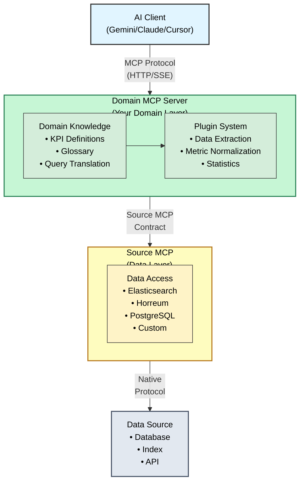

# Documentation Index

Complete documentation for Domain MCP servers built from this template.

## 🚀 Getting Started

Start here if you're new to the project:

- **[Quick Start Guide](quickstart.md)** - Get running in 5 minutes
- **[AI Clients Configuration](ai-clients.md)** - Setup Gemini, Claude Desktop, or Cursor
- **[LLM Integration Guide](llm-integration.md)** - Natural language query endpoint (NEW)
- [Main README](../README.md) - Project overview and features

## 👨‍💻 For Developers

Technical documentation for developers and engineers:

- **[Developer Guide](DEVELOPERS.md)** - Architecture, development workflow, API reference
- [Development Plan](../domain_mcp_development_plan.md) - Roadmap and changelog
- [Testing Guide](testing-guide.md) - Test procedures and validation
- [LLM Query Testing](llm-query-testing.md) - Testing the natural language query endpoint (Phase 6)

## 📚 Reference

### Domain Knowledge
- **[Example Domain: PerfScale](EXAMPLE_DOMAIN.md)** - Complete reference implementation (boot time metrics)
- **[Domain Glossary](domain-glossary.md)** - Domain-specific concepts, metrics, and data access patterns (example)
  - Shows how natural language queries are translated to domain concepts
  - Demonstrates efficient data access strategies

### Deployment
- **[Kubernetes Deployment](kubernetes-deployment.md)** - Production Kubernetes/OpenShift setup
- [Container Setup Guide](deployment/container-setup.md) - Podman/Docker deployment
- [Memory Optimization](memory-optimization.md) - Large query handling and memory sizing

### Troubleshooting
- **[Troubleshooting Guide](troubleshooting.md)** - Common issues and solutions
- [Prompt Testing Guide](prompt-testing-guide.md) - Testing AI assistant interactions
- [Prompt Test Results](prompt-test-results.md) - Test result examples

## 🔧 Technical Specifications

### Contracts and APIs
- **[Source MCP Quickstart](SOURCE_MCP_QUICKSTART.md)** - 5-minute guide with examples (START HERE)
- [Source MCP Contract](contracts/source-mcp-contract.md) - Complete backend interface specification
  - **Code-first** schema approach
  - Backend-agnostic design
  - Pagination and caching support

### Plugin Development
- [Plugin Template](plugins/plugin-template.py) - Complete plugin implementation guide with best practices
- [Plugin Scaffold](../src/domain/plugins/plugin_scaffold.py) - Starting template with TODOs for your domain
- Example plugin specs available for reference (boot time, performance metrics)

## 🏛️ Architecture

### System Design

### Key Components

1. **Domain Knowledge Layer** - Translates natural language to data queries
2. **Plugin System** - Domain-specific metric extraction
3. **Source Adapter** - Backend-agnostic data access
4. **MCP Server** - HTTP/SSE transport for AI clients

## 📦 Deployment Options

| Environment | Guide | When to Use |
|------------|-------|-------------|
| **Local Development** | [Quick Start](quickstart.md) | Testing and development |
| **Containers** | [Container Setup](deployment/container-setup.md) | Local testing, CI/CD |
| **Kubernetes** | [Kubernetes Deployment](kubernetes-deployment.md) | Production at scale |

## 🔍 By Use Case

### I want to...

**...get started quickly**
→ [Quick Start Guide](quickstart.md)

**...connect an AI assistant**
→ [AI Clients Configuration](ai-clients.md)

**...deploy to production**
→ [Kubernetes Deployment](kubernetes-deployment.md)

**...understand domain concepts and metrics**
→ [Example Domain: PerfScale](EXAMPLE_DOMAIN.md) - See how domain knowledge is structured
→ [Domain Glossary](domain-glossary.md) - Example glossary structure

**...develop a new plugin**
→ [Developer Guide](DEVELOPERS.md) - Plugin Development section
→ [Phase 4: Multi-Domain Architecture](../domain_mcp_development_plan.md#phase-4-multi-domain-architecture) (shared utilities plan)

**...troubleshoot an issue**
→ [Troubleshooting Guide](troubleshooting.md)

**...optimize for large queries**
→ [Memory Optimization](memory-optimization.md)

**...understand the architecture**
→ [Developer Guide](DEVELOPERS.md) - Architecture section

## 📜 Historical Documentation

Previous integration work and resolved issues may be archived for reference:

- [Archive](archive/) - If available, contains integration journey, resolved bugs, and evolution documentation
  - AI client integration history
  - MCP protocol implementation notes
  - Source MCP evolution and feature requests

## 🤝 Contributing

See [Contributing Guide](../CONTRIBUTING.md) for:
- Development workflow
- Code style and standards
- Testing requirements
- Pull request process

## 📄 License

Apache License 2.0 - See [LICENSE](../LICENSE) file for details.

---

## Quick Links by Role

### **End Users** (AI Assistant Users)
1. [Quick Start](quickstart.md)
2. [AI Clients Configuration](ai-clients.md)
3. [Troubleshooting](troubleshooting.md)

### **Developers** (Contributors)
1. [Developer Guide](DEVELOPERS.md)
2. [Example Domain: PerfScale](EXAMPLE_DOMAIN.md) - Reference implementation
3. [Plugin Template](plugins/plugin-template.py) - Development guide
4. [Testing Guide](testing-guide.md)
5. [LLM Query Testing](llm-query-testing.md) - Natural language endpoint testing

### **Operators** (DevOps/SRE)
1. [Kubernetes Deployment](kubernetes-deployment.md)
2. [Container Setup](deployment/container-setup.md)
3. [Memory Optimization](memory-optimization.md)
4. [Troubleshooting](troubleshooting.md)

### **Architects** (System Designers)
1. [Developer Guide - Architecture](DEVELOPERS.md#architecture)
2. [Source MCP Contract](contracts/source-mcp-contract.md)
3. [Domain Glossary - Data Access](domain-glossary.md#data-access-patterns)

