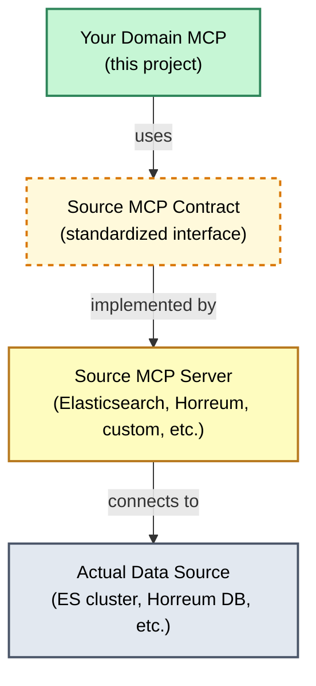

# Source MCP Contract - 5-Minute Quickstart

> **What is this?** A quick guide to the "Source MCP Contract" - the interface your Domain MCP uses to fetch data from any backend (Elasticsearch, Horreum, databases, etc.).

## The Big Picture



**Key Idea:** Your Domain MCP never talks directly to databases. It talks to a "Source MCP" through a standard contract, making it easy to swap data sources.

## Connection Modes

Your Domain MCP can connect to a Source MCP in two ways:

### stdio Mode (Process Launching)

Domain MCP **launches** the Source MCP as a subprocess and communicates via stdin/stdout.

**Config Example (Elasticsearch):**
```json
{
  "endpoint": "docker",
  "type": "stdio",
  "stdio_args": [
    "run", "-i", "--rm",
    "-e", "ES_URL", "-e", "ES_API_KEY",
    "docker.elastic.co/mcp/elasticsearch",
    "stdio"
  ],
  "env": {
    "ES_URL": "http://host.docker.internal:9200",
    "ES_API_KEY": "your-api-key"
  }
}
```

**Pros:**
- ✅ Simple: One process manages everything
- ✅ No separate server to run
- ✅ Good for local development

**Cons:**
- ❌ Process overhead for each request (if not kept alive)
- ❌ Harder to scale (one subprocess per Domain MCP instance)

**Best for:** Local development, Elasticsearch MCP, standalone deployments

---

### HTTP Mode (External Server)

Source MCP runs as a **separate HTTP server**, Domain MCP connects to it.

**Config Example:**
```json
{
  "endpoint": "http://horreum-mcp:3000",
  "type": "http",
  "api_key": "your-source-mcp-token",
  "timeout_seconds": 30
}
```

**Pros:**
- ✅ Scalable: Multiple Domain MCPs share one Source MCP
- ✅ Source MCP can be managed independently
- ✅ Better for production deployments

**Cons:**
- ❌ Need to run/manage Source MCP separately
- ❌ Network dependency (latency, failures)

**Best for:** Production deployments, Horreum MCP, shared infrastructure

---

### Choosing a Mode

| Scenario | Recommended Mode | Reason |
|----------|------------------|--------|
| Local development | **stdio** | Simpler, no extra processes |
| Elasticsearch (standalone MCP) | **stdio** or **HTTP** | Both supported via Docker |
| Elasticsearch 9.2.0+ | **HTTP** | Use built-in MCP endpoint |
| Horreum Source | **HTTP** | Horreum MCP runs as service |
| Production (multiple domains) | **HTTP** | Share one Source MCP instance |
| Production (single domain) | **Either** | Depends on operational preferences |
| CI/CD testing | **stdio** | Isolated, no external dependencies |

## The Four Core Methods

Every Source MCP must implement these methods:

| Method | Purpose | When to Use |
|--------|---------|-------------|
| `source_describe()` | Get Source info (name, version, capabilities) | Health checks, initialization |
| `tests_list()` | List available "tests" or "data categories" | Discover what data is available |
| `datasets_search()` | Fetch actual data filtered by time/labels | Main data retrieval |
| `label_values()` | Get pre-computed values (optional fast path) | Efficient KPI queries |

## Method Details with Examples

### 1. `source_describe()` - Who are you?

**Purpose:** Identify the Source MCP and check connectivity.

**Request:**
```json
{
  "jsonrpc": "2.0",
  "method": "source_describe",
  "params": {},
  "id": 1
}
```

**Response:**
```json
{
  "jsonrpc": "2.0",
  "result": {
    "name": "Elasticsearch MCP",
    "version": "1.0.0",
    "source_type": "elasticsearch",
    "capabilities": {
      "label_values": false,
      "pagination": true,
      "time_filtering": true
    }
  },
  "id": 1
}
```

**Python Code (Adapter):**
```python
async def source_describe(self) -> dict:
    # Call Source MCP's describe endpoint
    return {
        "name": "My Elasticsearch MCP",
        "version": "1.0.0",
        "source_type": "elasticsearch"
    }
```

---

### 2. `tests_list()` - What data do you have?

**Purpose:** Discover available data categories (ES indices, Horreum test schemas, DB tables, etc.).

**Request:**
```json
{
  "jsonrpc": "2.0",
  "method": "tests_list",
  "params": {},
  "id": 2
}
```

**Response (Elasticsearch example):**
```json
{
  "jsonrpc": "2.0",
  "result": {
    "tests": [
      {
        "id": "logs-app-*",
        "name": "Application Logs",
        "description": "Daily application log indices"
      },
      {
        "id": "metrics-system-*",
        "name": "System Metrics",
        "description": "System performance metrics"
      }
    ]
  },
  "id": 2
}
```

**Response (Horreum example):**
```json
{
  "jsonrpc": "2.0",
  "result": {
    "tests": [
      {
        "id": "123",
        "name": "boot-time-verbose",
        "description": "Boot time performance test"
      }
    ]
  },
  "id": 2
}
```

**Python Code (Adapter):**
```python
async def tests_list(self) -> dict:
    # For Elasticsearch: list index patterns
    # For Horreum: list test schemas
    # For DB: list table names
    return {"tests": [...]}
```

---

### 3. `datasets_search()` - Give me the data!

**Purpose:** Fetch actual data, filtered by time range, test ID, labels, etc.

**Request:**
```json
{
  "jsonrpc": "2.0",
  "method": "datasets_search",
  "params": {
    "test_id": "logs-app-*",
    "start_time": "2024-01-01T00:00:00Z",
    "end_time": "2024-01-07T23:59:59Z",
    "labels": {
      "region": "us-west",
      "env": "production"
    },
    "limit": 100
  },
  "id": 3
}
```

**Response:**
```json
{
  "jsonrpc": "2.0",
  "result": {
    "datasets": [
      {
        "id": "doc-123",
        "test_id": "logs-app-*",
        "timestamp": "2024-01-02T10:30:00Z",
        "data": {
          "latency_ms": 45,
          "status": "success",
          "region": "us-west",
          "env": "production"
        }
      },
      {
        "id": "doc-124",
        "test_id": "logs-app-*",
        "timestamp": "2024-01-02T10:31:00Z",
        "data": {
          "latency_ms": 52,
          "status": "success",
          "region": "us-west",
          "env": "production"
        }
      }
    ],
    "total": 1542,
    "cursor": "next-page-token"
  },
  "id": 3
}
```

**Python Code (Adapter):**
```python
async def datasets_search(
    self,
    test_id: str,
    start_time: str,
    end_time: str,
    labels: dict = None,
    limit: int = 100
) -> dict:
    # Build query for your source (ES Query DSL, SQL, etc.)
    # Fetch data
    # Return in standard format
    return {"datasets": [...], "total": ..., "cursor": ...}
```

---

### 4. `label_values()` - Fast path (optional)

**Purpose:** Get pre-aggregated values without fetching full datasets (performance optimization).

**Request:**
```json
{
  "jsonrpc": "2.0",
  "method": "label_values",
  "params": {
    "test_id": "123",
    "label_name": "boot_time_mean",
    "start_time": "2024-01-01T00:00:00Z",
    "end_time": "2024-01-07T23:59:59Z"
  },
  "id": 4
}
```

**Response:**
```json
{
  "jsonrpc": "2.0",
  "result": {
    "values": [
      {
        "timestamp": "2024-01-02T00:00:00Z",
        "value": 42.3,
        "labels": {"os": "rhel", "arch": "x86_64"}
      },
      {
        "timestamp": "2024-01-03T00:00:00Z",
        "value": 41.8,
        "labels": {"os": "rhel", "arch": "x86_64"}
      }
    ]
  },
  "id": 4
}
```

**Note:** Not all Source MCPs support this. Check `capabilities.label_values` in `source_describe()`.

---

## Data Flow Example

Let's trace a real query: *"Show me application latency for the last week"*

1. **Domain MCP receives query** from AI client
2. **Domain MCP → Source MCP:** `tests_list()` to find "application logs" test ID
3. **Domain MCP → Source MCP:** `datasets_search(test_id="logs-app-*", start_time=...)`
4. **Source MCP → Data Source:** Translates to ES query, SQL, etc.
5. **Data Source → Source MCP:** Returns raw data
6. **Source MCP → Domain MCP:** Returns standardized JSON datasets
7. **Domain MCP:** Plugin extracts "latency_ms" into `MetricPoint` objects
8. **Domain MCP → AI client:** Returns canonical metrics

## Schema Files Reference

All request/response schemas are in `schemas/`:

- `source_describe_request.json` / `source_describe_response.json`
- `tests_list_request.json` / `tests_list_response.json`
- `datasets_search_request.json` / `datasets_search_response.json`
- And more...

**Python validation:** See `src/schemas/source_mcp_contract.py` for Pydantic models.

## Adapter Implementation Checklist

When creating a new Source MCP adapter:

- [ ] Implement `source_describe()` - return name, version, capabilities
- [ ] Implement `tests_list()` - map your data categories to "tests"
- [ ] Implement `datasets_search()` - translate filters to your source's query language
- [ ] (Optional) Implement `label_values()` if source has pre-aggregated data
- [ ] Handle pagination with `cursor` if dataset is large
- [ ] Map source timestamps to ISO 8601 strings
- [ ] Wrap source data in `data` field of each dataset object

## Example Adapters

**Elasticsearch Adapter:** `src/adapters/elasticsearch.py`
- Maps ES indices to "tests"
- Translates time/label filters to ES Query DSL
- Returns search hits as datasets

**Horreum Adapter:** `src/adapters/horreum.py`
- Maps Horreum test schemas to "tests"
- Fetches datasets by run IDs
- Supports `label_values()` for pre-computed metrics

## Quick Tips

1. **Always use ISO 8601 timestamps** (e.g., `2024-01-01T00:00:00Z`)
2. **Pagination is critical** - set reasonable `limit` defaults (100-1000)
3. **Label filtering** - implement at source level for performance
4. **Error handling** - return meaningful errors in Source MCP if query fails
5. **Test with fixtures** - create sample responses in `tests/fixtures/`

## Further Reading

- [Full Contract Specification](contracts/source-mcp-contract.md) - Complete details
- [Adapter Examples](../src/adapters/) - Working implementations
- [Example Domain: PerfScale](EXAMPLE_DOMAIN.md) - How Horreum maps to contract

